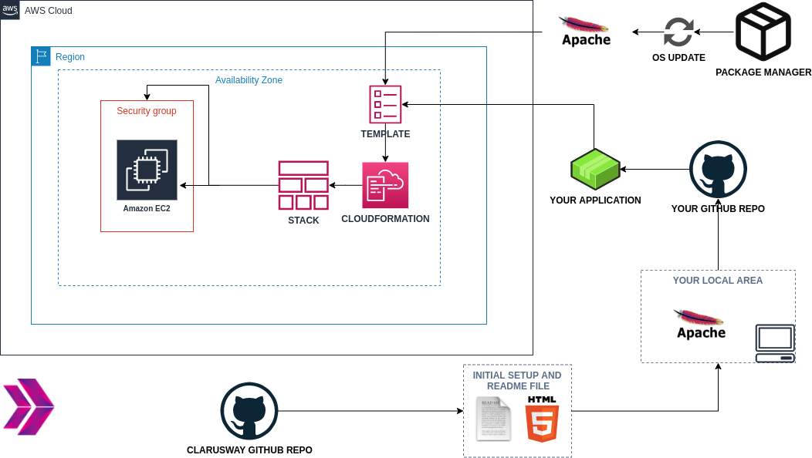
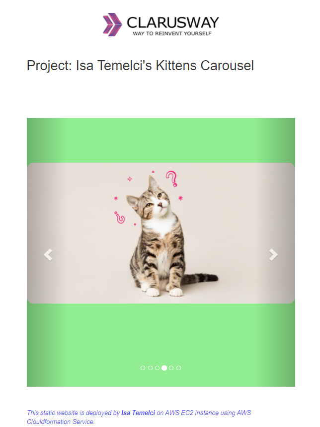

# Project-101 : Kittens Carousel Static Website deployed on AWS EC2 using Cloudformation

## Description
Kittens Carousel is a static website application deployed with Apache Web Server on AWS Elastic Compute Cloud (EC2) Instance using AWS Cloudformation Service. 

## Problem Statement



- Your company has recently started a web application project that will serve as an attraction point for pet lovers. As a first step of the project, developers in your team have prepared a preliminary design of kittens carousel application and pushed necessary files for the project to the repository on Github. 

- Your task is to show the how the design of application looks as static web page in the development environment. Thus, you need to deploy the web application using the `index.html` and an images given within the `static-web` folder. Note the followings for your web application.
   
   - User should face first with `index.html` when web app started.

   - Application should be deployed on Apache Web Server.

   - Application should be deployed in the development environment on AWS EC2 Instance using AWS Cloudformation Service. In the development environment, you can configure your Cloudformation template using the followings,

      - The application stack should be created with new AWS resources. 
   
      - The application should run on Amazon Linux 2 EC2 Instance

      - EC2 Instance type can be configured as `t2.micro`.

      - Instance launched by Cloudformation should be tagged `Web Server of StackName` 

      - The Web Application should be accessible via web browser from anywhere.

      - The Application files should be downloaded from Github repo and deployed on EC2 Instance using user data script within cloudformation template. 

      - Kittens Carousel Application Website URL should be given as output by Cloudformation Service, after the stack created.

## Project Skeleton 

```
101-kittens-carousel-static-website-ec2 (folder)
|
|----readme.md         # Given to the students (Definition of the project)          
|----cfn-template.yml  # To be delivered by students (Cloudformation template)
|----static-web
        |----index.html  # Given to the students (HTML file)
        |----cat0.jpg    # Given to the students (image file)
        |----cat1.jpg    # Given to the students (image file)
        |----cat2.jpg    # Given to the students (image file)
```

## Expected Outcome



### At the end of the project, following topics are to be covered;

- Apache Web Server Installation on Linux

- Static Website Deployment

- Bash scripting

- AWS EC2 Service

- AWS Security Groups Configuration

- AWS Cloudformation Service

- AWS Cloudformation Template Design

- Git & Github for Version Control System

### At the end of the project, students will be able to;

- install Apache Web Server on Amazon Linux 2.

- improve bash scripting skills using `user data` section in Cloudformation to install and setup web application on EC2 Instance.

- configure AWS EC2 Instance and Security Groups.

- configure Cloudformation template to use AWS Resources.

- use AWS Cloudformation Service to launch stacks.

- use git commands (push, pull, commit, add etc.) and Github as Version Control System.

## Steps to Solution
  
- Step 1: Download or clone project definition from `clarusway` repo on Github 

- Step 2: Create project folder for local public repo on your pc

- Step 3: Prepare a cloudformation template to deploy your app on EC2 Instance

- Step 4: Push your application into your own public repo on Github

- Step 5: Deploy your application on AWS Cloud using Cloudformation template to showcase your app within your team.

## Notes

- Customize the application by hard-coding your name instead of `student_name` within `index.html`.

## Resources

- [AWS Cloudformation User Guide](https://docs.aws.amazon.com/AWSCloudFormation/latest/UserGuide/Welcome.html)
